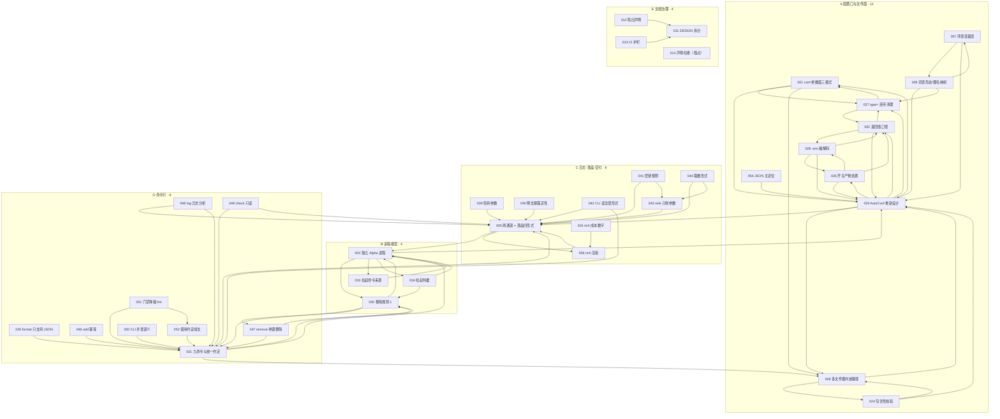
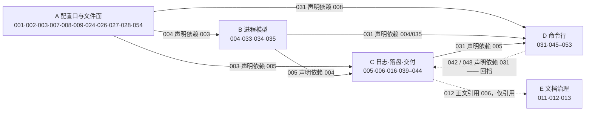
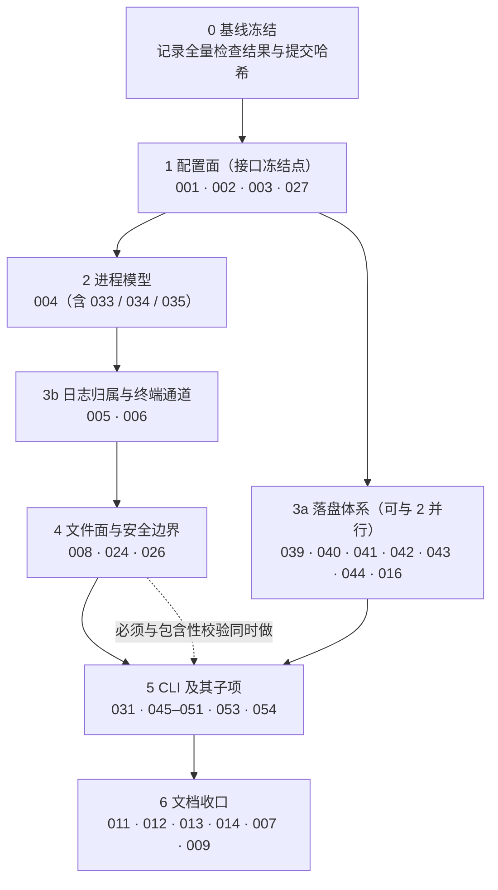
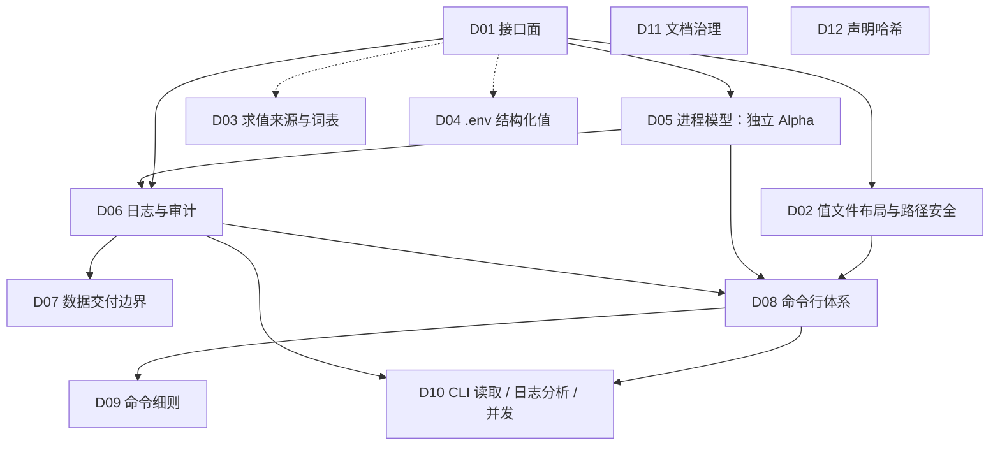

# `docs/issues/archive/` 文件关系拓扑

> **范围**：`docs/issues/archive/` 下的 39 个文件 —— 37 个 issue + `README.md` + `_TEMPLATE.md`。
> **口径**：以文件正文为准。依赖取每份文件元数据表的「依赖」字段，并与 `README.md` 发布清单逐条核对（37/37 一致）。
> **定位**：本文是分析产物，不属于该目录「一个编号一个文件」的发布清单，因此放在 archive 的上一级。

> **状态（2026-10-05 重组后）**：本文描述的是**重组前**的 37 文件结构，作为那次重组的诊断依据保留，正文不再随目录变化。
> 重组后的 12 个决策单元见 [README.md](docs/issues/archive/README.md)；本文 §10 给出重组后的单元级拓扑。
> 重组前的 37 份原件在嵌套仓库的 `94fa1b4` 提交里（`git -C docs/issues checkout 94fa1b4 -- archive`）。

---

## 1. 结论速览

1. **这里不是一棵树，也不是一张 DAG。** 37 个 issue 之间有 **71 条声明依赖边**，其中 **16 个文件构成一个强连通分量**（001/002/003/004/005/006/008/024/026/027/028/031/033/034/035/047），另有 007/009 一对互指。拓扑排序在这张图上不成立。
2. **「一个决策拆成头尾」是主要原因，不是偶然。** 五个决策族（A 配置口与文件面、B 进程模型、C 日志落盘与交付、D 命令行、E 文档治理）里，**头文件写结论、尾文件写参数与连带清理**；头尾之间用「依赖」字段互相指认，方向既不统一，也没写全。
3. **「头 → 尾」这条边在文件里根本不存在。** 只有「尾 → 头」（依赖字段）。**16 个文件在依赖字段里的入度为 0**，其中 15 个正是各族的尾 —— 单看文件，它们和独立问题没有区别。要还原头尾，只能读 `README.md` §4 的人工分层，或逐篇读正文小节。
4. **真正的实施顺序只存在于 `README.md` §4**，而它漏了一份文件（ISSUE-028），并且把两份 breaking 设计变更（007/009）放进了「文档收口」阶段。
5. **代码热区把五个族焊在一起**：`src/onconf/_engine.py` 被 27/37 个 issue 触及，`src/onconf/__init__.py` 17 个，`src/onconf/_audit.py` 14 个。按 issue 独立并行实现是不可能的。
6. **还有一批「尾」从没被拆出去**：各头文件的「未决事项」里仍有大量无编号的开放问题（031 有 8 条、008 有 5 条、003 / 004 / 009 各 3 条……）。它们既是头又是尾，这正是「散开」的第二种形态。

---

## 2. 文件清单与三种角色

| 层 | 文件 | 数量 | 作用 |
|---|---|---|---|
| 元文件 | `README.md`、`_TEMPLATE.md` | 2 | 发布清单、编号处置表、实施顺序、格式模板。**不参与依赖图**，但 README 是唯一记录「并入 / 作废」的地方 |
| issue | `ISSUE-001` … `ISSUE-054`（存在 37 个） | 37 | 每份自包含五节：背景 / 结论 / 变更项 / 验收标准 / 未决事项 |

编号 `001`–`054` 里**有 17 个编号不单独成文**（并入 14 个、作废 3 个），它们的去处只写在 `README.md` §3，见本文附录 A。这 17 个编号仍被正文引用，构成「指向不存在文件」的边。

### 2.1 按角色分

| 角色 | 判据 | 文件 |
|---|---|---|
| **头**（结论的拥有者，被 ≥2 个文件声明为依赖） | 入度 ≥ 2 | 005(11)、003(10)、031(10)、004(5)、002(4)、008(4)、027(4)、035(4)、001(2)、006(2)、011(2)、026(2)、028(2)、043(2) |
| **尾**（被拆出去的子问题，无人把它写成依赖） | 入度 = 0 且不是孤点 | 012、013、016、039、040、041、042、044、045、046、048、049、050、051、054 |
| **链节**（只挂在唯一一个头上） | 入度 = 1 | 007、009、024、033、034、047、053 |
| **孤点** | 入度 = 出度 = 0，正文不引用任何编号也不被引用 | **014**（`declaration_hash`） |

**关键观察**：14 个头里有 **13 个同时出现在另一个头的依赖字段里**（唯一例外是 011），所以「头 / 尾」不是文件属性，而是**边属性**——同一个文件在不同族里角色不同。024、047、033、034、053、007、009 则是只挂在唯一一个头上的链节。

计数校验：14 头 + 7 链节 + 15 尾 + 1 孤点 = 37。

---

## 3. 六类边

| 编号 | 边 | 是否写在文件里 | 数量 | 说明 |
|---|---|---|---|---|
| E1 | **声明依赖** | 是（元数据表「依赖」字段 + README 发布清单） | 71 | 唯一的显式边；两处已核对一致 |
| E2 | **正文引用** | 是（正文里的 `ISSUE-NNN`） | 其中 21 条两向都没声明依赖 | 头引用自己的尾（005→039/040、003→054、031→045/046）就走这一类 |
| E3 | **头 → 尾（拆分）** | **否** | 由 §5 人工还原 | 全靠 `README.md` §4 + 正文小节标题推 |
| E4 | **并入 / 作废** | 部分（只在 README §3） | 17 个编号 | 010/015/017–023/025/029/032/037/052 并入，030/036/038 作废 |
| E5 | **影响面重叠** | 是（元数据表「影响面」+ 变更项 `file:line`） | 13 个源码文件 | 决定「哪些 issue 不能并行」 |
| E6 | **跨目录悬空引用** | 是（正文写绝对路径） | 2 处 | 039 / 042 指向 `docs/issues/ISSUE-031-cli-command-system.md`（上一层工作区副本），本目录里应写 `ISSUE-031` |

---

## 4. 完整依赖拓扑

### 4.1 全部 71 条声明依赖（按决策族着色）

### 4.2 族间依赖（把上图折叠成人能读的规模）

**族级也有环**：`C → D`（005→031）与 `D → C`（031→042、031→048）同时存在 —— 日志族是 CLI 的数据来源，CLI 又要读日志，两族互为前提。

### 4.3 强连通分量（谁和谁互相指认）

| 分量 | 成员 | 成因 |
|---|---|---|
| **16 节点大分量** | 001 002 003 004 005 006 008 024 026 027 028 031 033 034 035 047 | 五个族各贡献 2–4 个节点，经 003（配置面）、005（日志）、031（CLI）、004（进程）四个枢纽串成一个环 |
| **2 节点** | 007 ↔ 009 | 环境变量层与键名映射互为前提 |
| 单点 | 其余 19 个 | 无环 |

**16 对互相声明依赖**：001↔027、001↔003、002↔027、002↔028、002↔003、003↔008、003↔026、004↔035、004↔033、004↔034、005↔006、007↔009、008↔024、026↔028、031↔035、035↔047。

「依赖」这个字段在这里被当成**四种不同的关系**在用：真前置（012 依赖 011）、同族互指（001↔027）、尾指头（042 依赖 031）、头指尾（005 依赖 006）。这就是拓扑排不出序的直接原因。

---

## 5. 决策族：头与尾（本文核心）

> 下表是 `README.md` §4、各文件「结论」小节标题、「变更项」跨文件指向三处交叉还原的结果。
> **这条边在任何单个文件里都读不出来** —— 这正是「一个决策分了之后，头是头、尾是尾」的具体形状。

### 族 A：配置口与文件面（11 个）

| 项 | 内容 |
|---|---|
| **头** | **003 配置口 `AutoConf` 重新设计** —— 参数面四组（A 能力开关 / B·C 文件与路径 / D 日志落盘 / 引导层与值层） |
| **尾** | 001、002、027（使用口协议，另成一组）· 008（多文件）· 024（包含性校验）· 026（开关产物）· 028（编码格式）· 007（环境变量层）· 009（词表）· 054（JSON 主定位） |
| **拆分方式** | 003 §1 A 组把开关交给 002/005/026；§2 文件面交给 008 + 054；§5 安全手段交给 024；未决事项把 `file_type=""` 交给 054 |
| **断裂点** | 003 的「结论」是**提纲式**的：每一节都指向另一个文件，但另一个文件不回头登记自己是 003 的哪一节。反向只能靠正文里的 `ISSUE-003` 字样 |

**A 族里还嵌着一个独立的 3 人环**：001（三模式签名）→ 002（返回值）→ 027（`type=` 连带清理）→ 001。三者是同一次 API 收敛的三刀：

| 文件 | 切的是哪一刀 | 为什么必须分开 |
|---|---|---|
| **001**（头） | 参数面从「三个条件合取」收敛为「只看 value 位」 | 定义签名，是接口冻结点 |
| **002**（尾） | 返回值 = 载体原生类型；取消类型推断 | 依赖 027 删类型字段，027 又依赖 001 删 `type=` 参数 |
| **027**（尾） | `type=` 删除后的持久状态清理（词表、Schema、哈希、`TypeConflictError`） | 横跨 `_core` / `_vocab` / `errors` 四个模块，与 001 是两件事 |

### 族 B：进程模型（4 个）

| 项 | 内容 |
|---|---|
| **头** | **004 进程模型：独立 Alpha 进程** —— 定义、生命周期、失败回退、读路由、日志归属、安全定位六节 |
| **尾** | 033（拉起命令来源）· 034（「多个事务」的判据） |
| **反向前置** | 035（移除规则 1）——**它既是 004 的前提**（就地写无损），**又是 004 的产物**（规则 1 失效于多进程） |
| **拆分方式** | 004 §2 定「不常驻、按需拉起」，§1 定「库负责启动」，两个维度各自抽出 033 / 034；004 的未决事项里还留着「关闭自启动资格的进程怎么办」（原本是 032，已并入） |
| **断裂点** | 004→033/034 是**单向**的：033/034 声明依赖 004，004 正文一句都没提 033/034；反向信息只在 §1 的一句「启动命令来源见 ISSUE-033，拉起判据见 ISSUE-034」 |

### 族 C：日志·落盘·交付（9 个）

| 项 | 内容 |
|---|---|
| **头** | **005 审计与日志：文件通道强制、终端通道可选** —— §1 两通道 / §2 筛选 / §3 取消 audit 开关 / §4 落盘四形式 / §5 库只产出数据 / §6 轮转可配 / §7 明文暴露 |
| **尾** | 006（终端渲染 rich）· 039（轮转参数）· 040（明文暴露定性）· 041（密钥）· 042（CLI 可读）· 043（sink 形态）· 044（取数形式）· 016（rich 成本数字） |
| **二级尾** | 043 → 044（sink 只收参数 → 那数据怎么取）；041 + 042 → 031（密钥入参落到 CLI） |
| **拆分方式** | 005 的每一节几乎都派生一个文件；§5「不发网络、不收函数」拆成 043，再由 043 拆出 044 |
| **断裂点** | 005↔006 互相声明依赖（唯一的 2 人环），实际是「头 005 定通道、尾 006 定通道内的渲染」；005 正文引用了 039/040，但 006 之外的尾都不写「本节出自 005」 |

### 族 D：命令行（9 个）

| 项 | 内容 |
|---|---|
| **头** | **031 命令行体系：九个命令的语义与分工** —— §1 命令表 / §2 `sync` 接规则 1 / §3 破坏性操作安全 / §4 十条统一约定 |
| **尾** | 045（`format` 范围）· 046（`add` 幂等）· 047（`remove`）· 049（`check` 只读）· 050（并发语义）· 051（门禁降级）· 053（约定成文）· 048（`log` 命令） |
| **已并入** | 037（破坏性操作形态）→ 031；052（`format` 覆盖范围）→ 045 |
| **反向前置** | 035 → 031（规则 1 移除后能力必须转进 CLI）；031 ↔ 035 互指 |
| **拆分方式** | 031 §1 的命令表**每新增一行就派生一个文件**；§5「现状入口处置」又单独派生 049/050/051 |
| **断裂点** | 031 声明依赖 004/005/008/035，**这四个文件里只有 035 提了 031**；031 正文还引用 `ISSUE-037`（已并入它自己）—— 自我指认的悬空引用 |

### 族 E：文档治理（4 个）

| 项 | 内容 |
|---|---|
| **头** | **011 `DESIGN.md` 结构治理：规格与决策日志分离** |
| **尾** | 012（陈旧状态声明批量修正）· 013（口径变更护栏进 CI） |
| **孤点** | **014 `declaration_hash`** —— 不依赖任何编号，也不被任何编号依赖，正文零引用 |
| **拆分方式** | 011 定「拆成两份文档」，012 拆行级修正、013 拆机器检查；012/013 的实施都以后者为前提 |
| **断裂点** | 011 输出度为 0（不声明任何依赖），但它是 012/013 的唯一前置；016 同时属于 C 族（rich）与 E 族（文档一致性） |

---

## 6. 唯一天然的拓扑序：`README.md` §4

这是全文唯一不带环的视图，也是发布与实施真正依据的顺序。

**顺序表与依赖图的三处不一致**：

| 现象 | 影响 |
|---|---|
| **ISSUE-028 不在 §4 任何一层里** | 它是 002 的尾、026 的前置，实际应在 3a 或阶段 4，但发布顺序里缺席 |
| **007 / 009 排在「6 文档收口」** | 两者都是 `设计变更（breaking）`，会改 `_core.py` / `_env_backend.py` / `_vocab.py`，与「文档收口」并列会误导执行 |
| **054 排在「5 CLI」** | 054 的声明依赖是 003，内容是 `file_type` 缺省值与 README 主辅标注，与 CLI 无关 |

---

## 7. 枢纽与不对称

### 7.1 枢纽（入度 / 被正文提及）

| 文件 | 依赖字段入度 | 被正文提及 | 含义 |
|---|---|---|---|
| **005** | 11 | 11 | 日志与落盘是全仓被引用最多的决策 |
| **003** | 10 | 11 | 配置口参数面是所有族的公共上游 |
| **031** | 10 | 13 | CLI 是最大的一族（9 个文件） |
| **004** | 5 | 5 | 进程模型改写安全不变量与日志归属 |
| **035** | 4 | 5 | 「移除规则 1」是唯一横跨进程族与 CLI 族的桥 |
| 002 / 008 / 027 | 4 | — | 使用口协议与文件面 |

### 7.2 单向声明（头不认尾）

下表第一列是头，第二列是**声明依赖它的文件**（即它的下家，含真前置与尾），第三列看这个头在正文里点没点过这些下家的名字。

| 头 | 声明依赖它的文件 | 头正文是否提及这些下家 |
|---|---|---|
| 003 | 001 002 004 007 008 009 024 026 028 054 | 只提及 001/002/005/008/026/027/054，**未提 004/007/009/024/028** |
| 005 | 003 006 031 039–044 048 049 | 只提及 006/039/040，**未提 003/031/041/042/043/044/048/049** |
| 031 | 035 042 045–051 053 | 提及 004/005/008/035/037/041/045/046/049 |
| 004 | 005 031 033 034 035 | 提及 003/033/034/035，**未提 005/031** |

### 7.3 「已定稿」压在「未定稿」上

7 份状态为「已定稿，待实现」的文件，其声明依赖里有状态未定的项：

| 文件 | 状态 | 依赖中未定稿的 |
|---|---|---|
| 001 | 已定稿 | 003（部分已定）、008（部分已定） |
| 002 | 已定稿 | 028（部分已定）、003（部分已定） |
| 005 | 已定稿 | 004（部分已定）、006（部分已定） |
| 012 | 已定稿 | 011（部分已定） |
| 016 | 已定稿 | 006（部分已定） |
| 042 | 已定稿 | 031（部分已定） |
| 051 | 已定稿 | 031（部分已定）、053（待决策） |

状态分布：**已定稿 9 / 部分已定 21 / 待决策 7**。分界不是「头 / 尾」，而是「形态 / 参数」：

- **已定稿的都是形态** —— 签名（001）、返回值（002）、通道（005）、`type=` 的处置（027）、sink 形态（043）、命令范围（042）、门禁判据（051）、文档拆分（011 待落地但形态已定）；
- **未定稿的几乎都是前置与默认值** —— `file_type` 缺省（003）、拉起判据（004）、词表形态（009）、环境变量层去留（007）、约定清单（053）。

也就是说：**协议已经冻结，但协议挂靠的那些默认值还悬着**，这正是依赖字段出现环的原因之一。

---

## 8. 七个断裂点

| # | 断裂 | 证据 | 后果 |
|---|---|---|---|
| 1 | **没有「头→尾」字段** | 16 个尾文件在依赖字段入度为 0；README §4 是唯一还原处 | 单看文件无法判断「这是谁拆出来的」 |
| 2 | **依赖字段混用四种语义** | 真前置 / 同族互指 / 尾指头 / 头指尾；16 对互指 | 无法拓扑排序，71 条边里大量是噪声 |
| 3 | **16 节点强连通分量** | 见 §4.3 | 实施顺序只能靠人工分层，改动一处依赖要重排五个族 |
| 4 | **悬空引用** | 031 正文引用 `ISSUE-037`（已并入 031 自己）；039 / 042 引用上一层工作区文件路径 `docs/issues/ISSUE-031-cli-command-system.md` | 按编号检索会指向不存在的目标 |
| 5 | **无编号的尾留在头的「未决事项」里** | 031 有 8 条、008 有 5 条、046 / 047 / 048 / 050 / 053 各 4 条；003 / 004 / 009 / 011 / 013 / 014 / 028 / 049 / 054 各 3 条 | 一个文件同时是头又是尾，粒度不齐 |
| 6 | **README §4 与实际依赖不一致** | 漏 ISSUE-028；007/009/054 分层与依赖不符 | 按 §4 执行会在阶段 6 撞上 breaking 变更 |
| 7 | **代码热区跨族** | `_engine.py` 被 27 个 issue 触及、`__init__.py` 17 个、`_audit.py` 14 个 | 这些文件是无法并行的串行点，也是「散开」在实现层的对应物 |

---

## 9. 如果要让这张图可读（建议，未执行）

1. **加两个字段**：`上位`（本文件从哪个头的哪一节拆出）与 `拆出`（本文件派生了哪些编号）。把 E3 从隐性变显性。
2. **把「依赖」拆成两列**：`前置`（必须先定稿，DAG）与 `同族`（口径联动，不构成顺序）。71 条边里 16 对互指占去 32 条，去掉后还剩 39 条，那 39 条才是决定顺序的候选。
3. **给无编号的尾补编号**，与 032 当年的做法一致（032 从 004 的未决事项里被提出来，后来并入 004；现在同样的情形还有一批）。
4. **修两处悬空引用**：031 正文的 `ISSUE-037` 改为「本文件 §3」；039 / 042 的跨目录路径改为 `ISSUE-031`。
5. **`README.md` §4 补上 028，并把 007/009/054 挪到与其依赖一致的层**。

---

## 附录 A：编号生命周期（17 个不单独成文的编号）

| 编号 | 原问题 | 去处 |
|---|---|---|
| 010 | 审计「默认关闭 → 不可关闭」取哪一个 | 并入 ISSUE-005 |
| 015 | `lock_timeout` 对公开 API 不可达 | 并入 ISSUE-003 |
| 017 | `log=os.devnull` 是事实上的关闭开关 | 并入 ISSUE-005 |
| 018 | 审计文件假定一个执行点 | 并入 ISSUE-004 |
| 019 | 词表变更是否算「变更事项」 | 并入 ISSUE-005 |
| 020 | `_engine.py:70-71` 注释仍写旧级别名 | 并入 ISSUE-012 |
| 021 | Alpha 成为执行点后日志落到自己的 stderr | 并入 ISSUE-004 |
| 022 | 握手之后是阻塞无超时的 `send`/`recv` | 并入 ISSUE-004 |
| 023 | 端点的生命周期语义 | 并入 ISSUE-004 |
| 025 | 日志级别与「日志不可关闭」的张力 | 并入 ISSUE-005 |
| 029 | 日志筛选器能否为空 | 并入 ISSUE-005 |
| 032 | 关闭自启动的进程后 Alpha 不存在怎么办 | 并入 ISSUE-004（**仍留在 004 的未决事项里，无编号**） |
| 037 | CLI 清理命令的形态与安全 | 并入 ISSUE-031（**031 正文仍按编号引用，悬空**） |
| 052 | `format` 还覆盖哪些后端 | 并入 ISSUE-045 |
| 030 | 开关关掉后已有产物的物理处置 | **作废**（词表锁死） |
| 036 | `TestRealProcesses` 双重绕开规则 1 | **消解**（自动清理已移除） |
| 038 | 变更文件与审计文件合并后装什么 | **作废**（变更文件概念取消） |

## 附录 B：代码影响面矩阵（E5）

| 源文件 | 触及它的 issue 数 | issue |
|---|---|---|
| `src/onconf/_engine.py` | **27** | 001 002 003 004 005 007 008 009 012 014 024 026 027 031 033 034 035 039 044 045 046 047 049 050 051 053 054 |
| `src/onconf/__init__.py` | 17 | 001 002 003 004 005 026 027 031 033 035 039 041 042 043 044 046 054 |
| `src/onconf/_audit.py` | 14 | 003 004 005 006 012 031 039 040 041 042 043 044 048 049 |
| `src/onconf/_core.py` | 9 | 001 002 007 009 014 027 031 035 041 |
| `src/onconf/_env_backend.py` | 9 | 002 007 008 009 026 028 045 047 054 |
| `src/onconf/_vocab.py` | 5 | 003 009 014 027 031 |
| `src/onconf/_toml_backend.py` | 4 | 002 045 047 054 |
| `src/onconf/_yaml_backend.py` | 4 | 002 008 045 047 |
| `src/onconf/_owner.py` | 4 | 004 033 034 041 |
| `src/onconf/errors.py` | 4 | 027 041 047 050 |
| `src/onconf/_json_backend.py` | 3 | 008 045 047 |
| `src/onconf/_lock.py` | 2 | 004 049 |
| `src/onconf/_textscan.py` | 1 | 028 |

**零代码足迹**：011、013、016（纯文档 / 流程），可与任何 issue 并行实现。
---

## 10. 重组后的单元拓扑（2026-10-05）

重组把 37 个 issue 收成 **12 个决策单元**（一个决策一个文件）。成员正文**逐字保留**、标题下沉一级、原编号写进 §0.1 成员索引，因此裁定内容一个字都没改。

### 10.1 单元与成员

| 单元 | 标题 | 成员（原编号） | 前置 | 联动 | 状态 |
|---|---|---|---|---|---|
| D01 | 接口面：使用口 `conf` 与配置口 `AutoConf` | 001、002、003、027、054 | 无 | D02、D03、D04、D06 | 待决策 |
| D02 | 值文件布局与路径安全 | 008、024 | D01 | D03、D05 | 部分已定 |
| D03 | 求值来源、键名与词表形态 | 007、009 | D01 | D02、D04 | 待决策 |
| D04 | `.env` 结构化值：开关、编解码与关闭后处置 | 028、026 | D01 | D03 | 部分已定 |
| D05 | 进程模型：独立 Alpha | 004、033、034、035 | D01 | D06、D08 | 部分已定 |
| D06 | 日志与审计：两通道与落盘形式 | 005、006、016、039、040 | D01、D05 | D07、D10 | 部分已定 |
| D07 | 数据交付边界：sink、密钥与取数 | 043、041、044 | D06 | D10 | 部分已定 |
| D08 | 命令行体系与使用约定 | 031、051、053 | D05、D06、D02 | D09、D10 | 待决策 |
| D09 | 命令细则：`format` / `add` / `remove` / `check` | 045、046、047、049 | D08 | D05、D06 | 待决策 |
| D10 | CLI 读取落盘、日志分析与并发 | 042、048、050 | D06、D08 | 无 | 待决策 |
| D11 | 文档治理：规格与决策日志分离 | 011、012、013 | 无 | 无 | 部分已定 |
| D12 | 声明哈希的处置 | 014 | 无 | 无 | 待决策 |

### 10.2 单元级前置图（DAG）

### 10.3 重组把哪些环解掉了

| 重组前的环 | 处理方式 |
|---|---|
| **16 节点强连通分量** | 成员被收进 6 个单元（D01/D02/D04/D05/D06/D08）。001↔027、003↔008、026↔028、004↔035、031↔035、035↔047 等互指对全部变成**单元内边**，从图上消失 |
| 007 ↔ 009 | 合成 D03，内部边 |
| 003 → 005 → 004 → 003 | 三个点分布在 D01 / D06 / D05。跨单元后仍是环，按「前置 vs 联动」拆开：只有 D01→D05、D05→D06、D01→D06 进前置图，004→003 记为联动 |
| 031 ↔ 035 | 031 进 D08、035 进 D05；031→035 进前置（D08 前置 D05），035→031 记为联动 |
| 004 → 003 与 003 → 005 等跨族边 | 折叠后跨单元边共 19 条，其中 13 条进入无环的前置图，其余全部登记为联动 |

### 10.4 数量对照

| 项 | 重组前 | 重组后 |
|---|---|---|
| 文件 | 37 个 issue + README + 模板 = 39 | 12 个单元 + README + 模板 = 14 |
| 声明依赖边 | 71 条 | 单元内边归零；跨单元 19 条 |
| 最大强连通分量 | 16 个节点 | 0（前置图为 DAG） |
| 「头 → 尾」的边 | 不存在，只能人工还原 | 单元内 §0.1 成员索引显式写出 |
| 原编号可追溯性 | 文件名即编号 | README §3 全量映射 + 单元内「（原 ISSUE-NNN）」 |
| 悬空引用 | 031 引用 ISSUE-037；039 / 042 引用上一层工作区路径 | 已改写为 archive 内可解析的写法（5 处，见 archive/README.md §3.4） |
| 无编号的尾 | 散在各头文件的「未决事项」里 | 仍在成员小节的「未决事项」里，但同一决策的成员已同处一个文件 |
