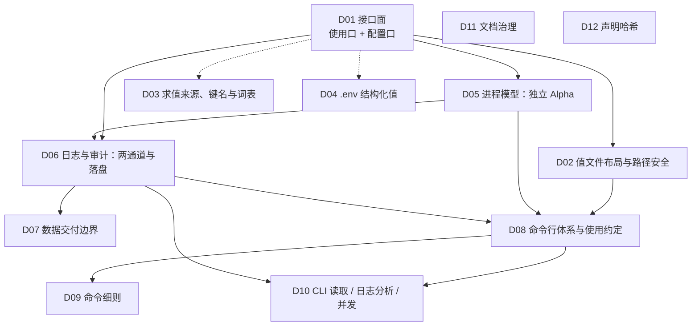

# OnConf 设计变更决策落档

> 本目录是 `docs/issues/` 重新设计工作区的**最终落档**形态。
> **一个决策一个文件**，每个文件可直接作为一条 GitHub issue 发布。
> 原始工作区保留在上一级目录 `docs/issues/`，仅作追溯，不随本目录发布。
> 重组前的 37 文件形态与诊断见上一级 `docs/issues/ARCHIVE-TOPOLOGY.md`；37 份原件在嵌套仓库的 `94fa1b4` 提交里。

---

## 1. 使用方式

- 文件名统一为 `DNN-<slug>.md`，`NN` 是**决策单元**序号 `01`–`12`。
- 每个单元自包含四段：**元数据表** → **§0 整体口径**（这个决策到底定了什么）→ **§0.1 成员索引** → **各成员小节**。
- 成员小节**逐字保留**重组前的原文，标题写作「标题（原 ISSUE-NNN）」；每节前的小表保留原作者、原依赖、原状态、原影响面。
- **唯一例外**：指向「已并入其它编号」与上一层工作区副本的交叉引用已改写为 archive 内可解析的写法（共 5 处，见 §3.4）。除这 5 处外，裁定内容一个字都没有改动。
- 正文里的 `ISSUE-NNN` 是**原始编号**，不是待发布编号。三处可查：单元内 §0.1 成员索引、本文 §3 编号映射。
- 发布与实施顺序按各单元的**前置**排列，不按单元序号，见 §4。
- `_TEMPLATE.md` 是格式模板，不是决策单元，发布时跳过。

### 状态取值

| 状态 | 含义 |
|---|---|
| 已定稿，待实现 | 结论完整，无未裁定项，可直接实现 |
| 部分已定 | 主体结论已定，仍有影响实现形态的未裁定项 |
| 待决策 | 主体结论尚未裁定，需要先做设计决定 |

**单元的「状态」取该单元内最不确定成员的状态**，并在下一行 `成员状态` 列出分布与具体未定稿的成员。

---

## 2. 决策单元清单

| 单元 | 标题 | 类型 | 优先级 | 状态 | 覆盖原编号 | 前置 |
|---|---|---|---|---|---|---|
| D01 | 接口面：使用口 `conf` 与配置口 `AutoConf` | 设计变更（breaking） | P0 / P1 / P2 | 待决策 | 001、002、003、027、054 | 无 |
| D02 | 值文件布局与路径安全 | 设计变更（breaking） | P1 | 部分已定 | 008、024 | D01 |
| D03 | 求值来源、键名与词表形态 | 设计变更（breaking） | P1 | 待决策 | 007、009 | D01 |
| D04 | `.env` 结构化值：开关、编解码与关闭后处置 | 设计变更 | P2 | 部分已定 | 028、026 | D01 |
| D05 | 进程模型：独立 Alpha | 设计变更（breaking） | P0 / P1 | 部分已定 | 004、033、034、035 | D01 |
| D06 | 日志与审计：两通道与落盘形式 | 设计变更 / 文档（breaking） | P0 / P1 / P2 | 部分已定 | 005、006、016、039、040 | D01、D05 |
| D07 | 数据交付边界：sink、密钥与取数 | 设计变更（breaking） | P1 | 部分已定 | 043、041、044 | D06 |
| D08 | 命令行体系与使用约定 | 设计变更 / 文档（新能力） | P1 / P2 | 待决策 | 031、051、053 | D05、D06、D02 |
| D09 | 命令细则：`format` / `add` / `remove` / `check` | 设计变更 / 任务 | P1 / P2 | 待决策 | 045、046、047、049 | D08 |
| D10 | CLI 读取落盘、日志分析与并发 | 设计变更 / 任务 | P1 / P2 | 待决策 | 042、048、050 | D06、D08 |
| D11 | 文档治理：规格与决策日志分离 | 任务 / 文档 | P1 / P2 | 部分已定 | 011、012、013 | 无 |
| D12 | 声明哈希的处置 | 缺陷 | P2 | 待决策 | 014 | 无 |

> 「类型 / 优先级 / 影响面 / 标签」的完整取值在各自单元文件的元数据表里；上表只列结构关系。

---

## 3. 编号映射（原 001–054）

### 3.1 已并入决策单元（37 个）

| 原编号 | 标题 | 所在单元 | 小节 | 原状态 |
|---|---|---|---|---|
| 001 | 使用口 `conf` 参数面收敛为三种模式 | D01 | §1 | 已定稿，待实现 |
| 002 | 使用口 `conf` 返回值口径与类型推断取消 | D01 | §2 | 已定稿，待实现 |
| 003 | 配置口 `AutoConf` 重新设计 | D01 | §3 | 部分已定 |
| 027 | `type=` 移除后「类型声明」的连带清理 | D01 | §4 | 已定稿，待实现 |
| 054 | 「本质上以 JSON 为主」的定位连带 | D01 | §5 | 待决策 |
| 008 | 多文件配置：键内嵌路径 | D02 | §1 | 部分已定 |
| 024 | 安全不变量：固定白名单 → 包含性校验 | D02 | §2 | 部分已定 |
| 007 | 环境变量层：删除还是补齐 | D03 | §1 | 待决策 |
| 009 | 词表形态、键名映射、按格式分档 | D03 | §2 | 部分已定 |
| 028 | `.env` 的 dict / list 编码格式与转义边界 | D04 | §1 | 部分已定 |
| 026 | 能力开关关闭后已有产物的处置 | D04 | §2 | 部分已定 |
| 004 | 进程模型：独立 Alpha 进程 | D05 | §1 | 部分已定 |
| 033 | 拉起 Alpha 的命令来源 | D05 | §2 | 部分已定 |
| 034 | 「识别到有多个事务」的判据 | D05 | §3 | 部分已定 |
| 035 | 移除进程内自动清理（规则 1） | D05 | §4 | 部分已定 |
| 005 | 审计与日志：文件通道强制、终端通道可选 | D06 | §1 | 已定稿，待实现 |
| 006 | 渲染层：`rich` 上线 | D06 | §2 | 部分已定 |
| 016 | `rich` 导入成本数字在仓库内有四个版本 | D06 | §3 | 已定稿，待实现 |
| 039 | 落盘规则与轮转参数由调用方声明 | D06 | §4 | 部分已定 |
| 040 | 明文值默认落盘后的暴露面定性 | D06 | §5 | 部分已定 |
| 043 | sink 只接受参数，不接收函数 | D07 | §1 | 已定稿，待实现 |
| 041 | 加密密钥由调用方提供，缺失且必需时报异常 | D07 | §2 | 部分已定 |
| 044 | 调用方自行发送数据时的取数形式 | D07 | §3 | 部分已定 |
| 031 | 命令行体系：九个命令的语义与分工 | D08 | §1 | 部分已定 |
| 051 | §28.3 门禁第 1 条降级为 lint 警告 | D08 | §2 | 已定稿，待实现 |
| 053 | 「使用约定」要成文 | D08 | §3 | 待决策 |
| 045 | `format` 只支持 JSON | D09 | §1 | 部分已定 |
| 046 | `add` 生成 `conf.py`：已存在时的行为、幂等与头注释 | D09 | §2 | 待决策 |
| 047 | 单键删除 `remove`：只动文件，不碰代码 | D09 | §3 | 部分已定 |
| 049 | `check` 必须一个字节都不写 | D09 | §4 | 部分已定 |
| 042 | 命令行必须能读取全部落盘形式 | D10 | §1 | 已定稿，待实现 |
| 048 | 日志分析命令缺失 | D10 | §2 | 待决策 |
| 050 | CLI 与运行中进程的并发语义 | D10 | §3 | 待决策 |
| 011 | `DESIGN.md` 结构治理：规格与决策日志分离 | D11 | §1 | 部分已定 |
| 012 | 陈旧状态声明批量修正 | D11 | §2 | 已定稿，待实现 |
| 013 | 口径变更护栏：从纸上约定变成 CI 可拦截 | D11 | §3 | 部分已定 |
| 014 | `declaration_hash` 计算了但从不用于短路 | D12 | §1 | 待决策 |

### 3.2 已并入其它编号（14 个，不单独成文）

| 原编号 | 原问题 | 去处 |
|---|---|---|
| 010 | 审计「默认关闭 → 不可关闭」这条反转取哪一个 | ISSUE-005 |
| 015 | `lock_timeout` 对公开 API 不可达 | ISSUE-003 |
| 017 | `log=os.devnull` 是事实上的关闭开关 | ISSUE-005 |
| 018 | 审计文件假定一个执行点 | ISSUE-004 |
| 019 | 词表变更是否算「变更事项」 | ISSUE-005 |
| 020 | `src/onconf/_engine.py:70-71` 注释仍写旧级别名 | ISSUE-012 |
| 021 | Alpha 成为执行点后日志落到 Alpha 自己的 stderr | ISSUE-004 |
| 022 | 握手之后是阻塞无超时的 `send` / `recv` | ISSUE-004 |
| 023 | 端点的生命周期语义 | ISSUE-004 |
| 025 | 日志级别与「日志不可关闭」的张力 | ISSUE-005 |
| 029 | 日志筛选器能否为空 | ISSUE-005 |
| 032 | 关闭了自启动的进程后 Alpha 不存在怎么办 | ISSUE-004 |
| 037 | CLI 清理命令的形态与安全 | ISSUE-031 |
| 052 | `format` 还覆盖哪些后端 | ISSUE-045 |

### 3.3 已作废 / 已消解（3 个）

| 原编号 | 原问题 | 处置 |
|---|---|---|
| 030 | 开关关掉后已有产物的物理处置 | 作废：词表锁死，不存在「关掉词表」 |
| 036 | `TestRealProcesses` 双重绕开规则 1 | 消解：自动清理已移除，该路径不存在 |
| 038 | 变更文件与审计文件合并后该文件装什么 | 作废：变更文件概念取消 |

---

### 3.4 已修正的交叉引用（5 处）

重组时成员正文逐字保留，仅下列 5 处指向「不存在的编号」或「上一层工作区副本」的引用被改写为 archive 内可解析的写法；**裁定内容未变**。

| 位置 | 原文 | 现文 |
|---|---|---|
| D06 §4（原 ISSUE-039）背景 | `docs/issues/ISSUE-031-cli-command-system.md:412` | 见 D08 原 ISSUE-031 §4 第 9 条 |
| D08 §1（原 ISSUE-031）背景 | 登记项 `ISSUE-037` 尚未落地 | 登记项（原 ISSUE-037）尚未落地 |
| D08 §1（原 ISSUE-031）未决事项 7 | （`ISSUE-037` 的落点） | （原 ISSUE-037 的落点，已并入本文件 §1） |
| D10 §2（原 ISSUE-048）背景 | `docs/issues/ISSUE-031-cli-command-system.md:362` | 命令表见 D08 原 ISSUE-031 §1 |
| D10 §1（原 ISSUE-042）结论 2 | `docs/issues/ISSUE-031-cli-command-system.md:410` | 见 D08 原 ISSUE-031 §4 第 7 条与未决事项 2 |

> `ISSUE-037` 已于重组前并入 ISSUE-031，因此上表两处写作「原 ISSUE-037」；其去处另见 §3.2。

---

## 4. 发布与实施顺序

顺序依据是**前置**（DAG，不含环），不按单元序号。`联动` 表示口径耦合、不决定顺序，见各单元元数据表。

### 4.1 阶段划分

| 阶段 | 内容 | 单元 | 规模与风险 |
|---|---|---|---|
| 0 | 基线冻结：记录改动前的全量检查结果与提交哈希 | — | 不记录就无法区分「改坏了」与「本来就是坏的」 |
| 1 | **接口冻结点**，之后各阶段基于它 | **D01** | 公开 API 破坏性变更；此后各阶段不再改 API 形态 |
| 2 | 进程模型（决定「执行点」） | D05 | **最高**：孤儿进程、端点残留、启动失败、超时定值；`_owner.py` 整体重写 |
| 3 | 日志与审计（含落盘四形式） | D06 | 现有测试大量断言单通道行为；3a 落盘体系可与阶段 2 并行，3b 终端归属依赖阶段 2 |
| 4 | 数据交付边界 | D07 | 与阶段 3 同批 |
| 5 | 文件面与安全边界 | D02 | 安全断言改写必须显式；必须与包含性校验同时做，顺序颠倒要改两遍 |
| 6 | 命令行 | D08 → D09 / D10 | `onconf` 入口现在是占位，要整个换掉；入口需分批，见 §4.2 |
| 并行 | 只依赖 D01，可与 2–6 同时做 | D03、D04 | — |
| 并行 | 无前置，全程可做 | D11、D12 | — |

**两条必须记住的耦合**：

1. 阶段 2 会改安全不变量，阶段 5 还要再改一次（白名单 → 包含性校验）。能一次改到位更好；分两次则各自都要显式声明（§4.3 第 3 条）。
2. 阶段 3 拆成两半：落盘体系（形式 / 加密 / 轮转）不依赖阶段 2；「终端回传发起方」依赖阶段 2 的「执行点」概念。

### 4.2 CLI 分四批

| 批 | 命令 | 为什么这个顺序 |
|---|---|---|
| 1 | `check` | 只读，最早可用；且它是「约定检查」的落点（D08 §3） |
| 2 | `build` / `sync` / `get` / `read` | 核心能力；`sync` 是规则 1 的新家（D05） |
| 3 | `remove` / `diff` / `log` | 依赖 D06 的日志；`diff` 需要先定义哈希索引 |
| 4 | `add` / `format` | `format` 只支持 JSON；`add` 要定「已存在时怎么办」 |

### 4.3 三条跨阶段硬约束

1. 实现过程中遇到任何新问题，**登记为新编号，不在代码或文档里当场改口径**。
2. 每个阶段结束跑全量检查：`uv run pytest`、`uv run ruff check`、`uv run mypy`，覆盖率不低于 90%。
3. 安全不变量的每次改动（`tests/test_security_invariants.py` 与威胁模型）必须在提交里单独说明，不得夹带。

### 4.4 本阶段的边界（不做的事）

| 不做 | 为什么 |
|---|---|
| 顺手「改进」任何未被裁定的行为 | 违反 §4.3 第 1 条 |
| 在阶段 1 之前动 `_owner.py` | Alpha 相关参数要先进 `EngineParams`，顺序错了要改两遍 |
| 引入任何新依赖 | `pyyaml` + `rich` 是定案；`format` 只覆盖 JSON 正是为了不引 `ruamel.yaml` |
| 提前做 D11 之外的文档整改 | 会与代码改动反复打架 |

---

## 5. 相关

- 重组前结构诊断与依赖分析：上一级 `docs/issues/ARCHIVE-TOPOLOGY.md`
- 重组前 37 份原件：嵌套仓库 `94fa1b4` 提交（`git -C docs/issues checkout 94fa1b4 -- archive`）
- 第一阶段裁定登记册与依据：上一级 `docs/issues/DECISIONS.md`（**历史**；结论已并入本目录各单元）
- 第一阶段设计漂移审计：上一级 `docs/issues/DESIGN-DRIFT-AUDIT.md`（**历史**）

